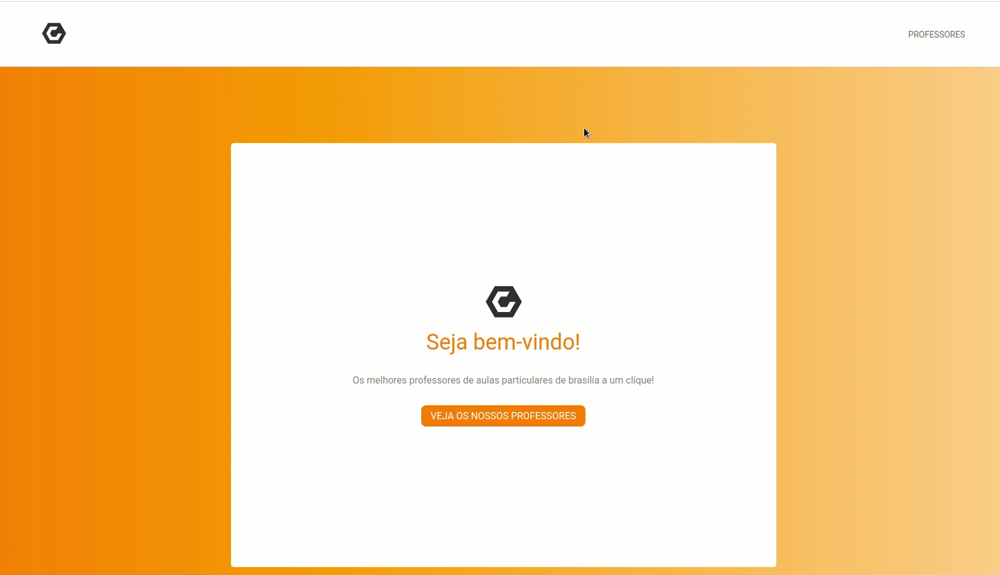

## Lista de professores com a biblioteca Parse



Instale as dependências

```console
yarn
```

Configure as variáveis de ambiente no arquivo .env para acessar o backend da aplicação de acordo com o arquivo de exemplo.

```console
cp .env-example .env
```

Execute o projeto.
```console
yarn start
```

Execute os testes com a biblioteca enzyme.

```console
yarn test
```

Execute os testes e2e com cypress. Previamente deixe o projeto executando em outro terminal.

```console
yarn cypress
```

Caso necessário, instale as dependências do cypress.

```console
./node_modules/.bin/cypress install
```

Clique em run all tests no navegador que irá aparecer em seguida.
